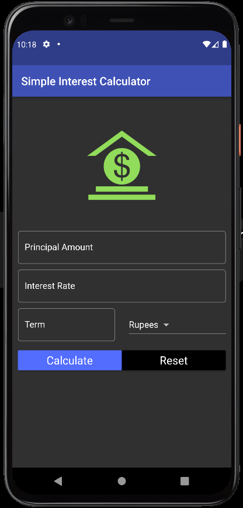
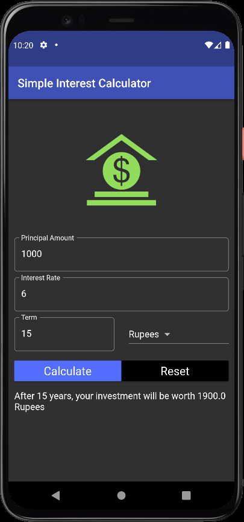
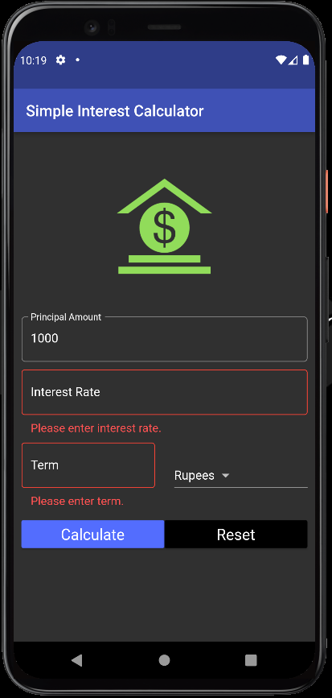

# Simple Interest Calculator

A new Flutter project.

## Getting Started

This project is a starting point for a Flutter application.

A few resources to get you started if this is your first Flutter project:

<table>
  <tr>
    <th><h3>Home Screen</h3></th>
    <th><h3>Output</h3></th>
    <th><h3>Form Validation</h3></th>
  </tr>
  <tr>
    <td></td>
    <td></td>
    <td></td>
  </tr>
</table>
